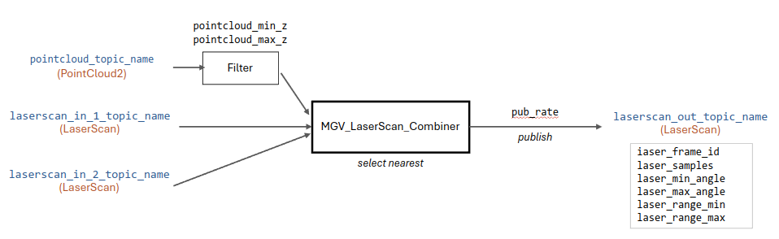
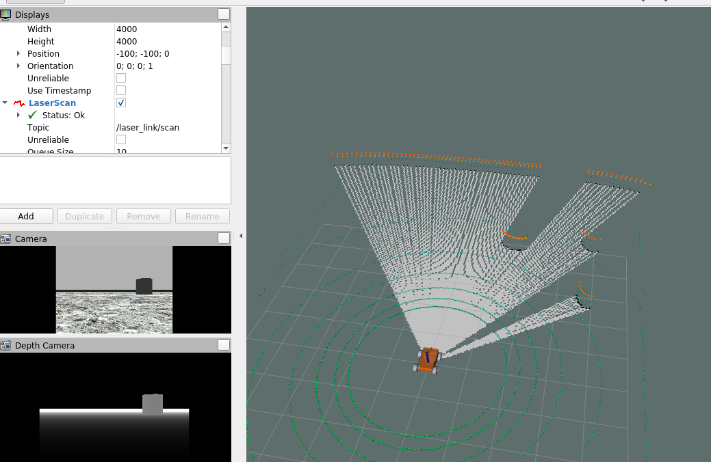

# Laserscan and Pointcloud Combiner

 

**Robotics and Autonomous Systems Group, Research Engineering Facility, Research Infrastructure**
**Queensland University of Technology**

## Introduction

The  Laserscan and Pointcloud Combiner is a ROS 1 package that is used to combine PointCloud2 and LaserScan input sources by selecting the nearest detection. The resulting detection is published to a LaserScan topic.  The package supports at most 1 PointCloud2 source and 2 LaserScan sources. Due to resampling, quantization error may be added in the processing.

More details will be provided.

## Developer

Dr Andrew Lui, Senior Research Engineer  
Robotics and Autonomous Systems, Research Engineering Facility  
Research Infrastructure  
Queensland University of Technology  

First version: 23 Jul 2024  
Latest update: Jul 2024